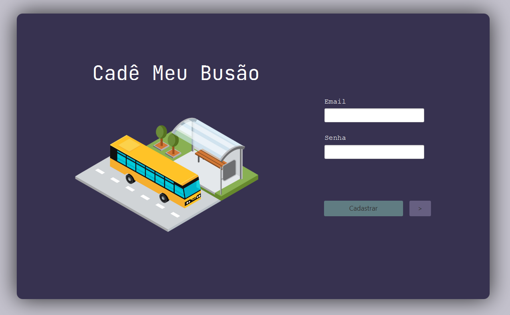
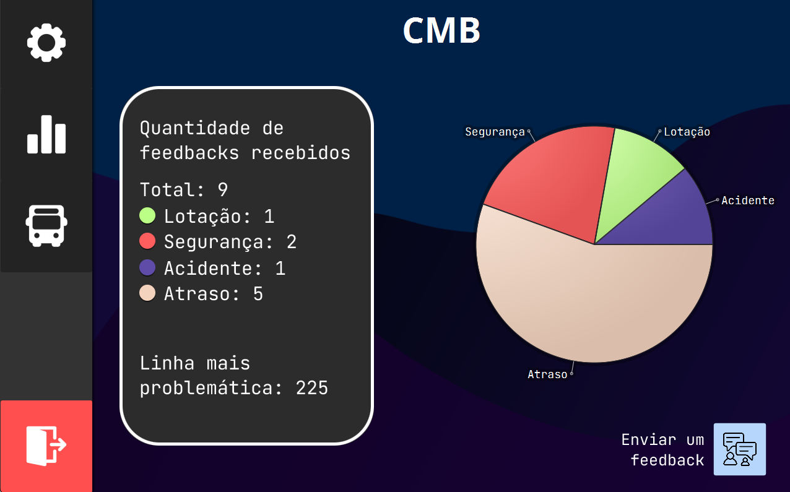
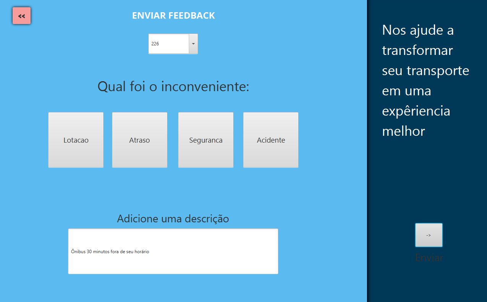
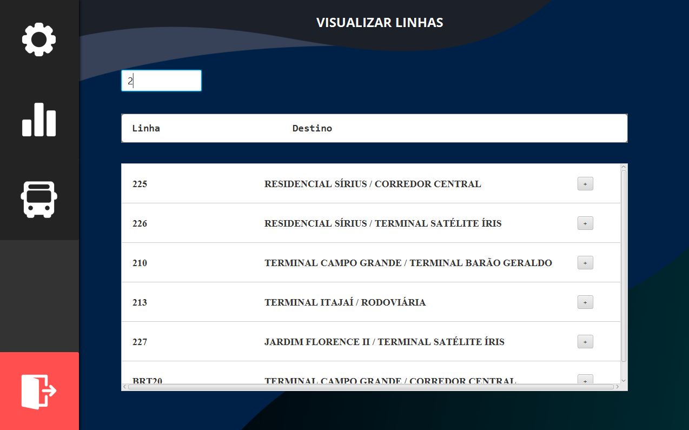
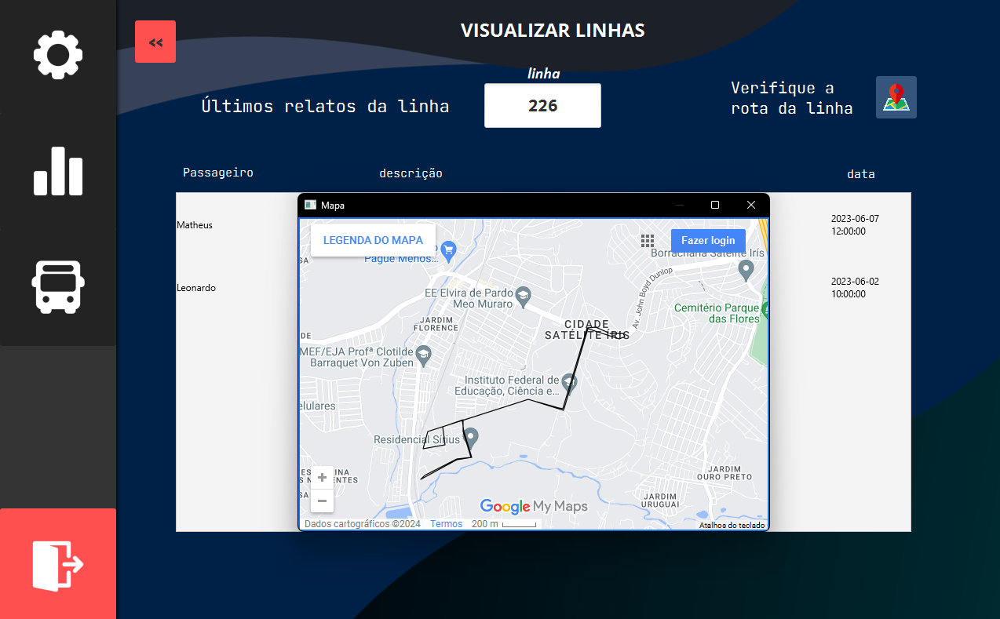

<<<<<<< HEAD
# CMB# Cadê meu Busão

# 
 CMB - Cadê meu Busão

 <a href="#Descrição">Descrição</a> |
 <a href="#Recursos">Recursos</a> |
 <a href="#Tecnologias">Tecnologias</a> |
 <a href="#Executar">Teste</a>

<section id="Descrição">

Desenvolvido na faculdade afim de exploar a integração entre Java e MySQL.
Cadê Meu Busão é um projeto que busca uma forma de melhorar a qualidade do transporte público. 
O sistema trás a opção para que passageiros de ônibus enviem suas reclamações enquanto possam visualizar de forma gráfica a situação dos ônibus no momento 
podendo filtrar entre linhas e até visualizar em um mapa a rota que a linha realiza
O principal objetivo é a exposição da situação atual do transporte público através de feedbacks de usuário
 
## Recursos Principais

- Acompanhamento da situação das linhas de ônibus.
- Cadastro e login de passageiros.
- Registro e análise de feedbacks.
- Visualização da rota da linha pelo mapa.

</section>

<section id="Recursos">

## Recursos Principais
- Cadastro e login de passageiros.

  

- Análise gráfica a partir dos feedbacks.

  

- Possibilidade de enviar seu próprio feedback para o sistema.

  

- Visualizar detalhes das linhas de ônibus.

  

- Visualização da rota da linha pelo mapa.

  

</section>

<section id="Tecnologias">

## Tecnologias Utilizadas

- Linguagem de Programação: Java
- Banco de Dados: MySQL
- Design: CSS for javafx
- Engenharia: Diagramas UML + Mapa de objetivos
- API: Google My Maps

## Como Executar o Projeto

1. Clone o Repositório.
2. Execute os scripts SQL para criar as tabelas necessárias.
3. Configuração do Projeto.
4. Execute o comando para iniciar o projeto. 

</section>

